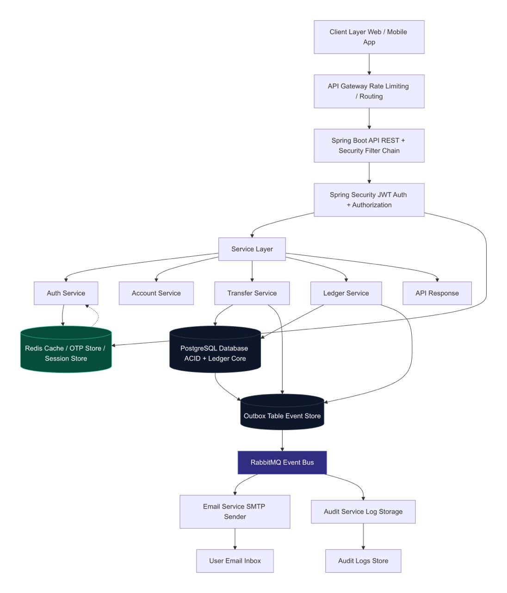
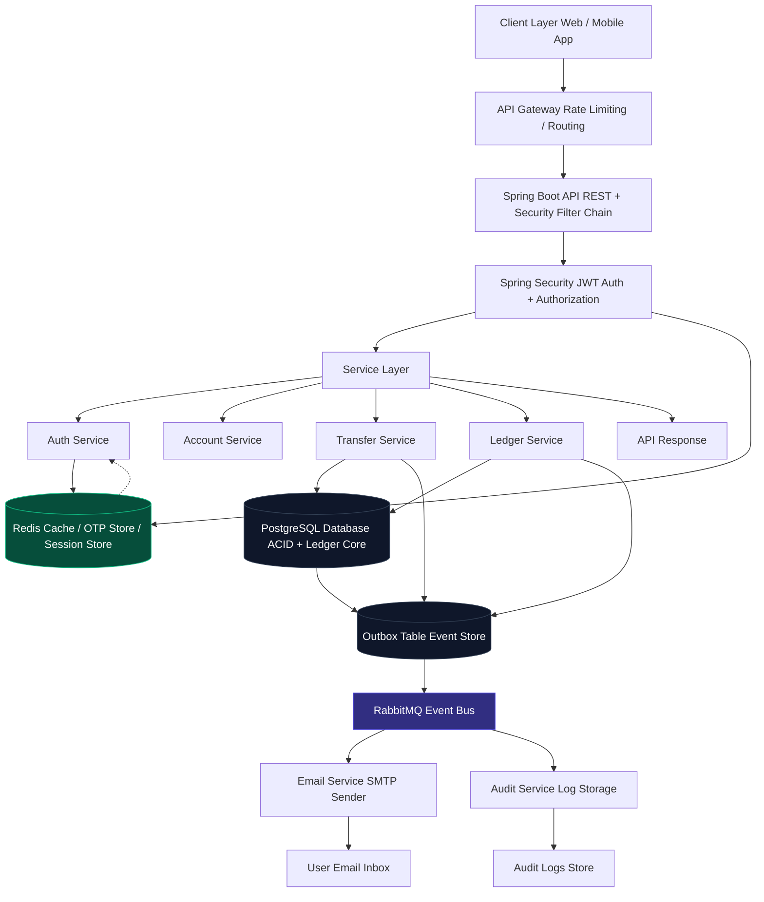

# Digital Banking Platform

A secure, event-driven digital banking platform built on Spring Boot, PostgreSQL, Redis, and RabbitMQ.



## Architecture Overview

### Client Layer
Web and mobile applications that interact with the platform via REST APIs.

### API Gateway
Entry point for all client requests. Handles rate limiting and request routing to backend services.

### Spring Boot API + Security
- **REST API** — Exposes secure endpoints for banking operations.
- **Security Filter Chain** — Intercepts requests for authentication and authorization.
- **Spring Security / JWT** — Issues and validates JWTs. Manages user sessions and role-based access.

### Service Layer
Core business logic split into four services:

| Service       | Responsibility                                              |
|---------------|-------------------------------------------------------------|
| **Auth Service**    | User registration, login, password reset, JWT lifecycle. Uses Redis for OTP/session storage. |
| **Account Service** | Account creation, balance queries, account details.         |
| **Transfer Service** | Money transfers between accounts. Writes to PostgreSQL and the Outbox table. |
| **Ledger Service**  | Immutable double-entry bookkeeping. Records all transactions. Writes to PostgreSQL and Outbox. |

### PostgreSQL
ACID-compliant primary database. Stores user accounts, balances, and the core ledger with full transactional integrity.

### Redis
In-memory cache used for OTP storage, session management, and frequently accessed data to reduce database load.

### Outbox Table (Event Store)
A relational table that acts as a message buffer. When transfers or ledger entries are created, an event is inserted into the Outbox alongside the database transaction, ensuring reliable event delivery.

### RabbitMQ (Event Bus)
Consumes events from the Outbox table and routes them to downstream consumers asynchronously.

### Consumers
- **Email Service** — Sends transaction notifications, OTPs, and alerts via SMTP to user inboxes.
- **Audit Service** — Persists audit logs for compliance, fraud detection, and historical tracking.

### API Response
The final response flows back to the client through the service and gateway layers.

## Module Structure Overview

```
                    ┌─────────────────────────────────────────────────────┐
                    │                   common-lib                        │
                    │  (SHARED LIBRARY)                                  │
                    │  DTOs, Constants, Utilities, Base Classes          │
                    └──┬──────────────────────────────────────────────────┘
                       │ depended on by all modules
                       v
┌────────────────────────────────┐
│          api-gateway           │
│  (SPRING CLOUD GATEWAY)       │
│  Rate Limiting / Routing      │
│  Security Filtering           │
└──────────┬─────────────────────┘
           │ forwards requests
           v
┌──────────────────────────────────────────────────────────────────┐
│                      core-app-service                            │
│              (SPRING BOOT RUNTIME - WIRES EVERYTHING)           │
│─────────────────────────────────────────────────────────────────│
│  Controllers (REST API)   │   Security (JWT Filter)            │
│  Exception Handlers       │   Service Orchestration            │
│  RabbitMQ Listeners       │   Spring Config / Properties       │
└──┬──────────────────────┬───────────────────────────────────────┘
   │ depends on           │ depends on
   v                      v
┌─────────────────┐  ┌─────────────────────────────────────┐
│   core-lib      │  │        core-data-lib                │
│ (BUSINESS LOGIC)│  │       (DATABASE LAYER)              │
│─────────────────│  │─────────────────────────────────────│
│ Ledger Engine   │  │ JPA Entities, Repositories         │
│ Transfer Rules  │  │ Flyway Migrations, Outbox Table    │
│ State Machines  │  │ PostgreSQL Configuration           │
│ Fraud Rules     │  └─────────────────────────────────────┘
└─────────────────┘

    ┌────────────────────────────┐       ┌────────────────────────────┐
    │      email-service         │       │      audit-service         │
    │  (RABBITMQ CONSUMER)      │       │  (RABBITMQ CONSUMER)      │
    │───────────────────────────│       │───────────────────────────│
    │ Listens to outbox events  │       │ Listens to outbox events  │
    │ Sends SMTP notifications  │       │ Persists audit logs       │
    └────────────────────────────┘       └────────────────────────────┘
```

### Module Descriptions

| Module | groupId | Role | Key Contents |
|--------|---------|------|-------------|
| **common-lib** | `com.bank.common` | Shared library used by all other modules | DTOs, constants, utility classes, base types |
| **core-lib** | `com.bank.core` | Pure domain logic (no framework deps) | Ledger engine, transfer validation, state machines, fraud rules |
| **core-data-lib** | `com.bank.core.data` | Data persistence layer | JPA entities, Spring Data repositories, Flyway migrations, Outbox table |
| **core-app-service** | `com.bank.core.app` | Main Spring Boot runtime | REST controllers, JWT security, exception handlers, service orchestration, RabbitMQ listeners |
| **api-gateway** | `com.bank.extern.gateway` | Client entry point (optional) | Spring Cloud Gateway routes, rate limiters, security filters |
| **email-service** | `com.bank.extern.email` | Async event consumer | RabbitMQ listener, SMTP mail sending (MailHog in dev) |
| **audit-service** | `com.bank.extern.audit` | Async event consumer | RabbitMQ listener, audit log persistence for compliance |

## Event Flow (Outbox Pattern)

```
Request → Service → PostgreSQL (data) + Outbox (event)
                                          ↓
                                     RabbitMQ
                                          ↓
                              ┌───────────┴───────────┐
                         Email Service           Audit Service
```

This guarantees at-least-once delivery without risking data inconsistency between the database and message broker.

## Tech Stack

| Component        | Technology             |
|------------------|------------------------|
| Language         | Java 17+               |
| Framework        | Spring Boot + Security |
| Build Tool       | Maven                  |
| Database         | PostgreSQL             |
| Cache            | Redis                  |
| Message Broker   | RabbitMQ               |
| Event Store      | Outbox Table           |
| API Gateway      | Spring Cloud Gateway |

## Getting Started

### Prerequisites
- Docker & Docker Compose
- Java 17+
- Maven

### Start External Services

```bash
cp .env.example .env
docker compose up -d
```

This starts PostgreSQL, Redis, RabbitMQ (management UI at `http://localhost:15672`), and MailHog (UI at `http://localhost:8025`).

### Stop Services

```bash
docker compose down
```

To also remove persisted data:

```bash
docker compose down -v
```

## Mermaid Source


